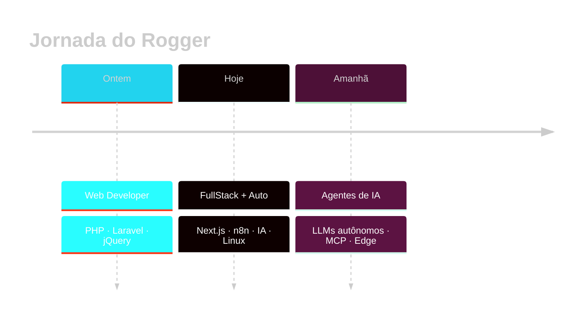

<!-- ╔══════════════════════════════════════════════════════════════════════════╗
     ║                  README.md  •  Rogger Brosco  •  v3.0                    ║
     ║          "Automatize tudo que for repetitivo. Crie o que for único."     ║
     ╚══════════════════════════════════════════════════════════════════════════╝ -->

<div align="center">

<a href="https://github.com/rbrosco">
  
</a>


<br/><br/>

<!-- Badges minimalistas no topo -->
<a href="https://www.youtube.com/@Roggerando">
  
</a>
<a href="https://www.instagram.com/roggerando/">
  
</a>
<a href="https://github.com/rbrosco?tab=followers">
  
</a>
<a href="https://github.com/rbrosco?tab=repositories&sort=stargazers">
  
</a>


</div>

```json
{
  "👤  nome":       "Rogger Brosco",
  "🎂  idade":      34,
  "🎓  formação":   "Análise e Desenvolvimento de Sistemas — UNINOVE",
  "💼  atuação":    ["n8n", "IA / LLMs", "React", "Next.js", "Node", "Python"],
  "🐧  ambiente":   "CachyOS • Arch Linux • Zsh + Neovim",
  "🎯  missão":     "Transformar processos manuais em fluxos autônomos",
  "📺  canal":      "youtube.com/@Roggerando",
  "🌎  fuso":       "America/Sao_Paulo  (UTC-3)",
  "⚡  status":     "Aberto para projetos & colaborações"
}
```

<!-- ─────────────────────────────  PROPOSTA DE VALOR  ───────────────────────── -->

<h2 align="center">🎯 O que eu faço</h2>

<table align="center" style="border-collapse: collapse; border: none;">
  <tr style="border: none;">
    <td align="center" width="33%" style="border: none;">
      <br/><br/>
      <b>⚙️ Automatizo</b><br/>
      <sub>Workflows com n8n para eliminar tarefas repetitivas.</sub>
    </td>
    <td align="center" width="33%" style="border: none;">
      <br/><br/>
      <b>🧠 Integro IA</b><br/>
      <sub>Agentes e pipelines com LLMs para negócios.</sub>
    </td>
    <td align="center" width="33%" style="border: none;">
      <br/><br/>
      <b>🚀 Construo</b><br/>
      <sub>Aplicações fullstack com foco em performance.</sub>
    </td>
  </tr>
</table>

<!-- ─────────────────────────────  STACK  ───────────────────────────────────── -->

<h2 align="center">⚡ Stack & Arsenal</h2>

<div align="center">

<table style="border: none;">
  <tr style="border: none;">
    <td align="center" width="25%" style="border: none;">
      <b>🤖 Automação & IA</b><br /><br />
      &nbsp;
      &nbsp;
      
    </td>
    <td align="center" width="25%" style="border: none;">
      <b>💻 Frontend</b><br /><br />
      &nbsp;
      &nbsp;
      &nbsp;
      
    </td>
    <td align="center" width="25%" style="border: none;">
      <b>⚙️ Backend</b><br /><br />
      &nbsp;
      &nbsp;
      &nbsp;
      
    </td>
    <td align="center" width="25%" style="border: none;">
      <b>🗄️ Infra & Dados</b><br /><br />
      &nbsp;
      &nbsp;
      &nbsp;
      
    </td>
  </tr>
</table>

<details>
<summary><b>🎨 Estilização & Ferramentas Extras</b></summary>
<br/>
&nbsp;&nbsp;
&nbsp;&nbsp;
&nbsp;&nbsp;
&nbsp;&nbsp;
&nbsp;&nbsp;
&nbsp;&nbsp;

<br/><br/>
</details>

</div>

<!-- ─────────────────────────────  STATS  ───────────────────────────────────── -->

<h2 align="center">📈 Métricas do Dev</h2>

<div align="center">

<a href="https://github.com/rbrosco">
  
  
</a>

<br/>

<a href="https://github.com/rbrosco">
  
  
</a>

<br/>


<br/><br/>


</div>

<!-- ─────────────────────────────  TIMELINE  ────────────────────────────────── -->

<h2 align="center">🗺️ Linha do Tempo</h2>



<!-- ─────────────────────────────  PROJETOS  ────────────────────────────────── -->

<h2 align="center">🛸 Projetos em Destaque</h2>

<div align="center">

<!-- TODO: Substitua 'seu-repositorio-aqui' pelo nome do seu melhor projeto -->
<a href="https://github.com/rbrosco?tab=repositories">
  
</a>

<br/><br/>

<a href="https://github.com/rbrosco?tab=repositories&sort=stargazers">
  
</a>

</div>

<!-- ─────────────────────────────  FRASE  ───────────────────────────────────── -->

<div align="center">

<br/>


</div>

<!-- ─────────────────────────────  CONTATO  ─────────────────────────────────── -->

<h2 align="center">📡 Vamos conectar?</h2>

<p align="center">
  <a href="https://www.youtube.com/@Roggerando">
    
  </a>
  <a href="https://www.instagram.com/roggerando/">
    
  </a>
  <a href="https://github.com/rbrosco">
    
  </a>
</p>

<p align="center">
  <sub>
    💡 <b>Tem um processo manual te consumindo tempo?</b><br/>
    Me chama — provavelmente dá pra automatizar.
  </sub>
</p>

<br/>

<div align="center">
  
</div>

<!--
  ╭──────────────────────────────────────────────────────────────╮
  │  Feito com ☕, 🐧 Linux e fluxos no n8n por @rbrosco          │
  ╰──────────────────────────────────────────────────────────────╯
-->